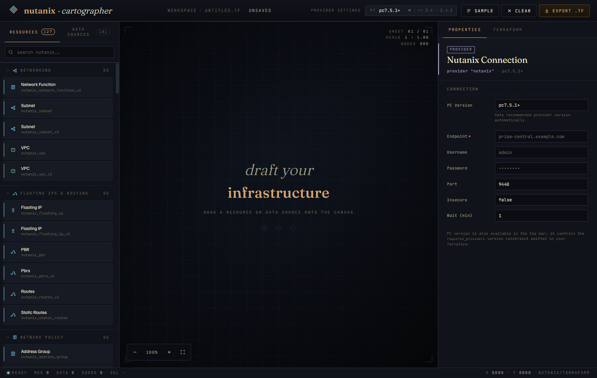
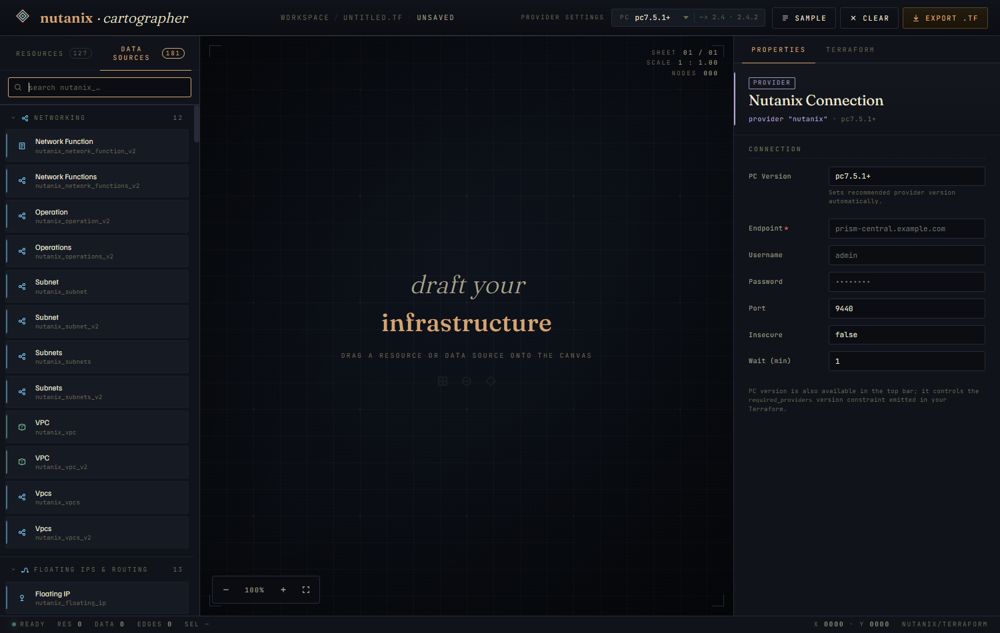
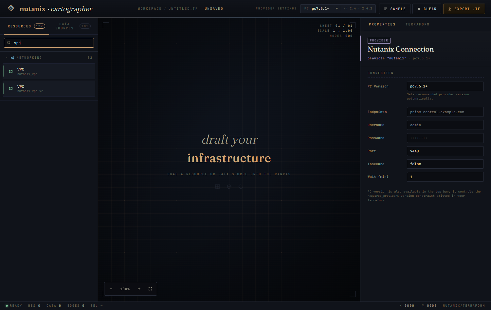
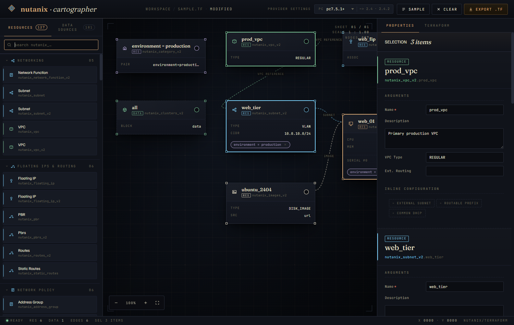
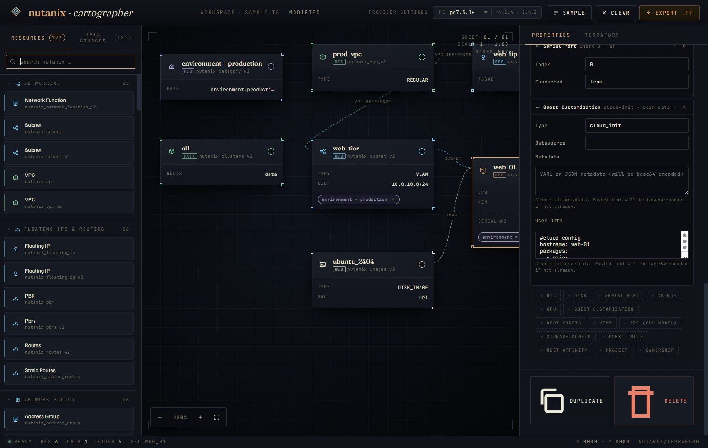
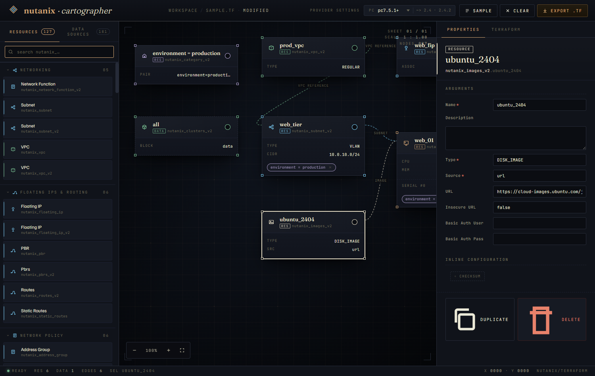
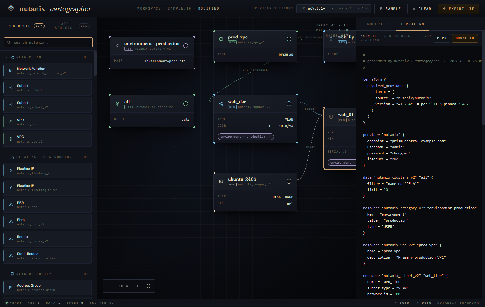
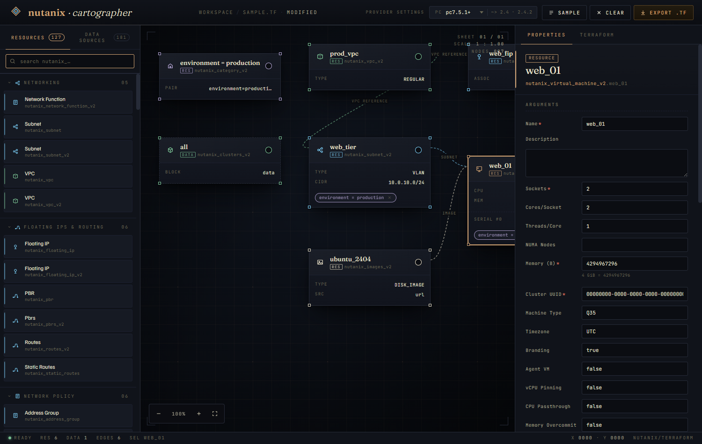

# Nutanix Terraform Cartographer

A single-file, browser-only design tool for the
[Nutanix Terraform provider](https://registry.terraform.io/providers/nutanix/nutanix/latest/docs).
Drag resources and data sources from a categorized palette onto a canvas, fill in their arguments
and inline configuration blocks (NICs, disks, sysprep / cloud-init, boot config, IP configs, …),
and export valid Terraform.

**Live demo:** <https://ahkarhul.github.io/ntnx-cartographer/>



---

## Quick start

`index.html` is the whole app — no server, no build step, no dependencies. Either:

- Open the live demo above in any modern browser, or
- Clone this repo and open `index.html` locally:

```sh
# any of these work
open index.html
xdg-open index.html
start index.html
```

---

## Workspace tour

The interface has four regions:

| Region | What it does |
|---|---|
| **Top bar** | Brand · workspace breadcrumb · `Provider Settings` label + PC version dropdown · `Sample` / `Clear` / `Export .tf` |
| **Palette** (left) | The full Nutanix provider catalog, grouped by domain, filterable. Drag items onto the canvas. |
| **Canvas** (center) | Your diagram. Cards represent resources or data sources; lines represent references. |
| **Inspector** (right) | Two tabs: **Properties** (edit selected card's args) and **Terraform** (live HCL preview of the whole diagram). |
| **Status bar** (bottom) | Resource count · data source count · edge count · current selection · cursor coordinates. |

---

## Provider settings

Provider config lives in the **top bar** (compact) and the **right pane** (full).

The PC version dropdown drives the `required_providers` version constraint emitted in your
Terraform — the matrix follows the official compatibility table from the provider's README.
Touching the dropdown opens the full provider form in the right pane:

- `endpoint`, `username`, `password`, `port`, `insecure`, `wait_timeout`
- The **Provider Settings** label is a clickable shortcut to the same form.

Default values are stripped from the generated `provider "nutanix" {}` block — only fields
you actually changed appear in the output.

---

## Palette: finding what you need

The provider catalog is huge (~120 resources + ~165 data sources). The palette has three
discovery affordances:

### Tabs

Switch between **Resources** and **Data Sources**:



### Search

Type any substring — type name or human label — to filter the catalog instantly. The category
groups collapse automatically to whatever has matches:



### Categories

Without a filter the catalog is grouped by domain: Networking · Floating IPs & Routing ·
Network Policy · Compute · Templates & OVAs · Images · Storage · Clusters & Hosts · Categories ·
Identity & Access · Protection & DR · Prism Central · Lifecycle (LCM) · Foundation · Guest Tools
(NGT) · Karbon (K8s) · NDB (Era) · Object Store · Self-Service (Calm) · Security & Keys ·
Miscellaneous. Click a category header to collapse / expand its section.

### Resources vs data sources

| | Resources | Data sources |
|---|---|---|
| **Purpose** | Create / manage Nutanix entities (a VM, subnet, image, …) | Look up existing entities (a cluster, an image already uploaded, …) |
| **HCL block** | `resource "nutanix_..." "name" { … }` | `data "nutanix_..." "name" { … }` |
| **Card border** | solid | dashed |
| **Editor** | typed schema with the resource's full argument set | universal `ext_id` / `$filter` / `$limit` / `$page` / `$orderby` / `$select` plus an extra-HCL escape hatch |

---

## Canvas: building the diagram

### Adding cards

Drag any palette tile onto the canvas. The card lands at the cursor and selects automatically
so you can edit it immediately.

### Selecting

- **Click a card** — single-select.
- **Drag-box** on empty space — selects every root card the rectangle intersects.
- **Shift / Ctrl / Cmd-click** a card — toggle in or out of the current selection.
- **Shift / Ctrl / Cmd-drag** a box — extend the existing selection.
- **Click empty canvas without dragging** — deselect everything (right pane returns to provider
  settings).

When more than one card is selected, the right pane stacks each card's full editor and offers
**batch Duplicate / Delete**:



### Moving cards

Drag a card by its header. If the card is part of a multi-selection, the whole group moves
together. Dragging works at any zoom level — the delta is corrected for scale.

### Connecting cards

Each card has a small port on the right side of its header. **Drag from a port to another
card** to create a reference.

The cartographer auto-picks the right reference field on the destination resource. Drag a
**subnet → VM** and you'll get a NIC pointing at that subnet; drag an **image → VM** and you'll
get a `disks { backing_info { … image_reference } }`. If no specific slot fits, a generic
`depends_on = [...]` is added instead.

References show on the canvas as dashed amber/cyan lines. Click a line to remove the reference.

### Pan & zoom

- **Middle mouse drag** — pan.
- **Ctrl + wheel** (or pinch) — zoom in/out around the cursor.
- **HUD bottom-left** — `+` / `−` zoom buttons and a reset.

The status bar shows the current zoom and live cursor coords in design space.

---

## Inspector: editing & previewing

### Properties tab

Single-select shows the card's full editor: required-fields are starred, schema enums become
dropdowns, lists become CSV inputs, etc.



#### Inline configuration (sub-blocks)

Many resources have nested HCL blocks beyond their top-level args. The cartographer exposes
these as **add-on cards** under the "Inline Configuration" section — click `+ NIC`, `+ Disk`,
`+ Cloud-Init`, etc. to materialize an editor for that block. Each item is a collapsible
expander with a × to remove. The catalog covers:

- **VM**: NICs, disks (with image / empty / volume_group / vm_disk_ref backings), serial ports,
  CD-ROMs, GPUs (with PCI address), boot config (legacy or UEFI), vTPM, APC (CPU model),
  storage config (flash / QoS), guest tools, host affinity, project, ownership, and
  **guest customization** (cloud-init *or* sysprep — base64-encoded automatically).
- **Volume Group**: disks, iSCSI features, storage features.
- **Subnet**: reserved/dynamic IPs, DHCP options, advanced ip_config, virtual_switch.
- **VPC**: external subnets (with external_ips, gateway_nodes, active_gateway_node), externally
  routable prefixes, common DHCP options.
- **Floating IP**: association (vm_nic or private_ip), floating_ip value (ipv4 or ipv6).
- **Network Security Policy**: rules (application / two-env-isolation / intra-group / multi-env).
- **Protection Policy**: replication locations, replication configurations.
- **Recovery Points**: VM and volume group recovery points.
- **Routes**: destination, next_hop, metadata.
- **PBRs**: full policy_match / policy_action with TCP/UDP/ICMP variants.
- **Service Groups / Address Groups / Cluster (config + network + nodes) /
  Authorization Policy / Access Control Policy / Directory Services / SAML IDP**, and more.

#### Variant gating

Selectors that determine which fields apply only render the relevant ones. For example,
choosing `vm_disk` or `object_lite` as an image source hides the URL fields entirely:



The same gating drives:

- VM disk backings (image / empty / volume_group / vm_disk_ref)
- VM guest_customization (cloud_init / sysprep)
- VM boot_config (legacy / uefi)
- Floating IP association (vm_nic / private_ip)
- VPC routable_prefix and Routes destination (ipv4 / ipv6)
- NDB Network type (DHCP / Static)
- Service Group ICMP (`is_all_allowed` true/false)

#### Default-stripping

Optional fields are emitted **only when you change them**. A VM whose `is_branding_enabled`
stays `true` (the schema default) doesn't get `is_branding_enabled = true` in the generated
HCL. Required fields are always emitted, even if their value happens to match the default,
because Terraform's plan would otherwise reject the resource.

### Terraform tab

Live, syntax-highlighted preview of the full diagram as Terraform. Updates on every edit:



- Provider block + `required_providers` come from the top-bar PC version.
- Data sources emit first.
- Resources emit in dependency order (categories → vpc → subnet → image → vm).
- `Copy` puts the rendered HCL on your clipboard; `Download` saves it as `main.tf`.
- The top-bar **`Export .tf`** button is the same as the inspector's `Download`.

---

## Sample diagram

The **`Sample`** button in the top bar loads a small reference layout:



It demonstrates the connection model and gives you something to delete cards from while
exploring. `Clear` empties the canvas (provider settings stay).

---

## Keyboard / mouse reference

| Action | Gesture |
|---|---|
| Add a resource / data source | Drag from palette → canvas |
| Single-select | Click a card |
| Toggle selection | Shift / Ctrl / Cmd-click a card |
| Box-select | Drag on empty canvas |
| Extend box-select | Shift / Ctrl / Cmd + drag on empty canvas |
| Deselect | Click empty canvas (no drag) |
| Drag a card | Drag its header |
| Drag a multi-selection | Drag any selected card's header |
| Connect | Drag from a card's port to another card |
| Disconnect | Click the connection line |
| Pan | Middle mouse drag |
| Zoom | Ctrl + wheel · or HUD `+` / `−` · or HUD reset |
| Delete selection | `Delete` or `Backspace` |
| Open provider settings | Click `Provider Settings` label · or focus PC dropdown |

---

## Architecture

- One file: `index.html`. The CSS and JavaScript are inlined; there are no `<script src>`
  dependencies (other than two Google Fonts via `<link>` for the type pairing).
- All schemas are in-document JS objects. Adding a new typed resource is a registry entry;
  adding a new sub-block is two registry entries (one for the editor, one for the codegen).
- Conditional field visibility is opt-in per field via `showIf(node.fields)` and a parent
  `triggersVisibility: true` flag — same machinery used by both top-level forms and
  inside sub-block bodies.
- Default-stripping happens at codegen via `stripDefaults(schema, fields)`: required fields
  always emit; optional fields whose value equals the schema default are dropped.

## Scope

- **In scope**: design-time authoring of Nutanix Terraform configurations. The output is HCL
  ready to feed into `terraform plan` / `apply`.
- **Out of scope**: actually executing Terraform, talking to a Prism Central, or validating
  resource UUIDs against a live cluster. The cartographer doesn't make network calls.

---

## License

[GPL-3.0](LICENSE).

## Security

See [SECURITY.md](SECURITY.md). Please use GitHub's private vulnerability reporting for any
security issues.
